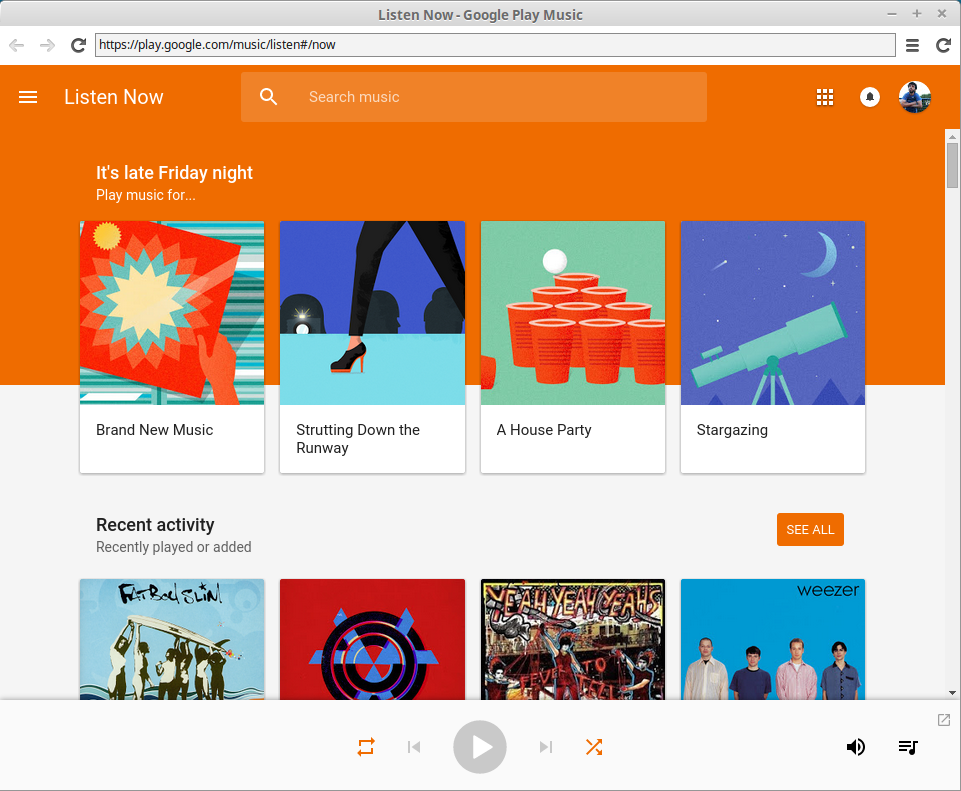

# google-music-webkit

[Google Music][] desktop client via [node-webkit][]

**Features:**

- Google Music as a standalone application
- Tray for quick play/pause/quit and tooltip with information
- Media key shortcuts



[Google Music]: http://music.google.com/
[node-webkit]: https://github.com/rogerwang/node-webkit

## Requirements
- [node-webkit@0.10.1][node-webkit] or greater
- [npm][], usually installed with [node][]
- [Adobe Flash][], see http://music.google.com/ for dependency information

[npm]: http://npmjs.org/
[node]: http://nodejs.org/
[Adobe Flash]: http://get.adobe.com/flashplayer/

## Getting Started
In a shell, run the following commands:

```bash
# Clone the repository
git clone https://github.com/twolfson/google-music-webkit
cd google-music-webkit

# Install node modules
npm install
# npm http GET https://registry.npmjs.org/obj-extend
# npm http 304 https://registry.npmjs.org/obj-extend
# obj-extend@0.1.0 node_modules/obj-extend

# Start the application via `node-webkit`
nw .
```

When the application has launched, it can be shown/hidden via its tray icon, .


#### Running without a terminal
For running `google-music-webkit` without a terminal, start via `screen`. Once it has launched, the terminal can be closed without exiting the application.

```bash
screen nw .
```

##### Gnome installation
If you are on Gnome/Cinnamon, you can use `./install-gnome.sh` to add the application to your menu.

```bash
./install-gnome.sh
# Google Music Webkit successfully installed!
```

## Documentation
### Icons
Source images are kept in the `resources/` folder. Icons are maintained via Inkscape and the `play/pause` buttons are isolated in layers.

To generate icons:

1. Export each of the play/pause/clean variants as a `.svg` file
2. Load the icons via GIMP as a 32x32 SVG
3. Export via GIMP as a `.png`

At the time of writing, Inkscape and Image Magick seemed to be generating non-transparent backgrounds upon converting SVG to PNG.

## Contributing
In lieu of a formal styleguide, take care to maintain the existing coding style. Add unit tests for any new or changed functionality. Lint via [grunt](https://github.com/gruntjs/grunt) and test via `npm test`.

## Donating
Support this project and [others by twolfson][gittip] via [gittip][].

[![Support via Gittip][gittip-badge]][gittip]

[gittip-badge]: https://rawgithub.com/twolfson/gittip-badge/master/dist/gittip.png
[gittip]: https://www.gittip.com/twolfson/

## Attribution
Headphones designed by Jake Dunham from [the Noun Project][headphones-icon]

[headphones-icon]: http://thenounproject.com/term/headphones/16097/

Modified `google-music-mac` source code from https://github.com/kbhomes/google-music-mac under [MIT license][google-music-mac-license].

[google-music-mac-license]: https://github.com/kbhomes/google-music-mac/tree/v1.1.3

## Unlicense
As of May 02 2014, Todd Wolfson has released this repository and its contents to the public domain, excluding that which has been attributed to other sources.

It has been released under the [UNLICENSE][].

[UNLICENSE]: UNLICENSE
